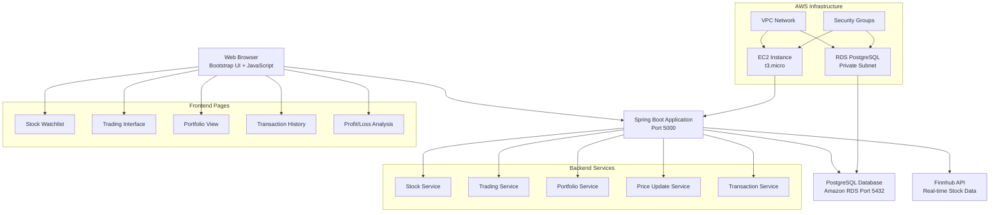
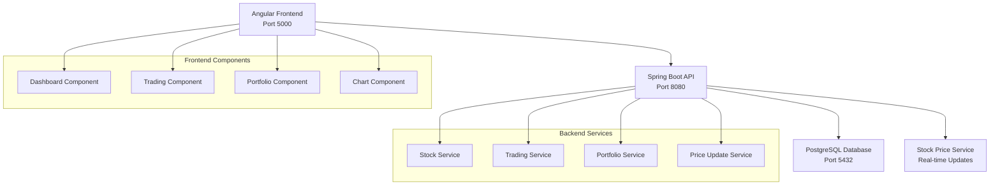

# Stockify

A real-time stock trading application with live market data and comprehensive trading capabilities.

[](https://spring.io/projects/spring-boot)
[](https://www.java.com/)
[](https://aws.amazon.com/)
[](https://www.postgresql.org/)

## Project Structure

```
├── src/                    # Source code
├── deployment/            # Deployment scripts
├── docker/               # Docker configuration
├── scripts/              # AWS management scripts
├── docs/                 # Documentation
├── build/                # Build artifacts
├── target/               # Maven build output
└── pom.xml              # Maven configuration
```

## Quick Start

### Local Development
```bash
mvn spring-boot:run
```

### Docker Deployment
```bash
./deployment/docker-deploy.sh
```

### AWS Deployment
```bash
./deployment/deploy-final.sh
```

## Tech Stack

### Backend
- **Java 17** - Core programming language
- **Spring Boot 3.2.0** - Application framework
- **Spring Data JPA** - Database abstraction layer
- **Hibernate** - ORM framework
- **Maven** - Dependency management and build tool

### Database
- **PostgreSQL** - Primary database
- **Amazon RDS** - Managed database service
- **HikariCP** - Connection pooling

### Frontend
- **Thymeleaf** - Server-side templating engine
- **Bootstrap 5.3.0** - CSS framework
- **JavaScript** - Client-side interactions
- **WebJars** - Frontend dependency management

### Infrastructure
- **Amazon EC2** - Application hosting (t3.micro)
- **Amazon RDS** - PostgreSQL database hosting
- **Amazon VPC** - Network isolation
- **Security Groups** - Network access control

### External APIs
- **Finnhub API** - Real-time stock market data
- **Alpha Vantage API** - Additional market data (configured)

## Architecture





## Features

### Core Functionality
- Real-time stock price monitoring (30-second updates)
- Dynamic stock watchlist management
- Buy/sell stock transactions
- Portfolio tracking and management
- Transaction history and logging

### Technical Features
- Automatic price updates via scheduled tasks
- RESTful API endpoints
- Database transaction logging
- Responsive web interface
- Memory-optimized deployment

## API Endpoints

### Stock Management
- `GET /api/stocks` - Get all stocks
- `GET /api/stocks/{symbol}` - Get specific stock (adds if not exists)
- `DELETE /api/stocks/{symbol}` - Remove stock from watchlist
- `POST /api/stocks/refresh` - Manual price update

### Trading
- `POST /api/trading/buy` - Buy stocks
- `POST /api/trading/sell` - Sell stocks

### Data Flow
- `GET /transactions` - View transaction history
- `GET /portfolio` - View current portfolio
- `GET /profit-loss` - View profit/loss analysis

## Database Schema

### Key Tables
- **stocks** - Stock information and current prices
- **transactions** - All buy/sell transaction records
- **portfolio** - Current stock holdings
- **account** - User account and cash balance

## Deployment

### Requirements
- Java 17+
- Maven 3.6+
- AWS Account (EC2 + RDS)
- Finnhub API key

### Environment Setup
```bash
# Clone repository
git clone https://github.com/tungle2709/Stockify.git
cd Stockify

# Build application
mvn clean package

# Deploy to EC2 (with memory optimization)
java -Xmx256m -Xms128m -jar target/stock-trading-app-1.0.0.jar
```

### Configuration
Update `application.properties`:
```properties
# Database Configuration
spring.datasource.url=jdbc:postgresql://your-rds-endpoint:5432/stockifydb
spring.datasource.username=your-username
spring.datasource.password=your-password

# API Configuration
finnhub.api.key=your-finnhub-api-key
finnhub.api.url=https://finnhub.io/api/v1
```

## Performance Optimizations

- JVM memory limits: `-Xmx256m -Xms128m`
- Connection pooling with HikariCP
- Scheduled updates every 30 seconds
- SQL logging disabled in production
- Optimized for t3.micro EC2 instances

## Live Demo

**URL**: [http://44.198.177.164:5000/](http://44.198.177.164:5000/)

### Available Pages
- `/` - Stock watchlist and search
- `/trading` - Buy/sell interface
- `/portfolio` - Portfolio overview
- `/transactions` - Transaction history
- `/profit-loss` - Performance analysis

## Contributing

1. Fork the repository
2. Create feature branch (`git checkout -b feature/new-feature`)
3. Commit changes (`git commit -m 'Add new feature'`)
4. Push to branch (`git push origin feature/new-feature`)
5. Open Pull Request

## License

This project is licensed under the MIT License - see the [LICENSE](docs/LICENSE) file for details.

---

**Built with Spring Boot and deployed on AWS**
